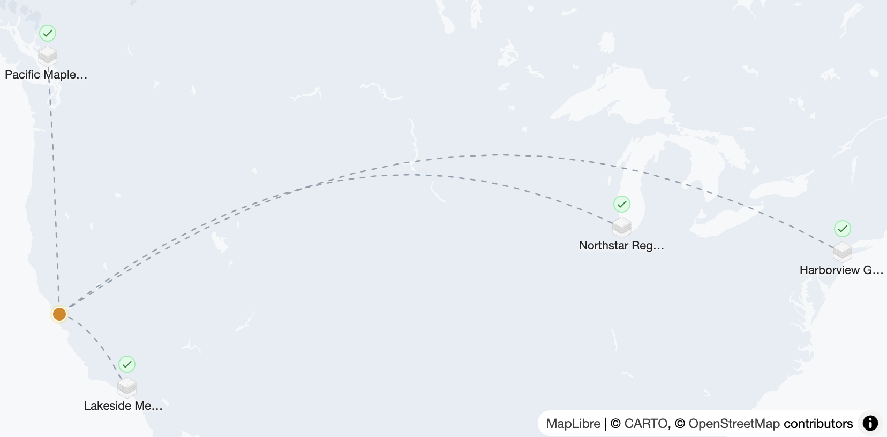

# Flower Collaborative Agent Hackathon

This demo runs a Flower Collaborative Agent across four SuperNodes. Each SuperNode has its own synthetic patient records in `data/`, with a different file format or layout for the agent to work with. This example uses [@flwrlabs/collaborative-agent](https://flower.ai/apps/flwrlabs/collaborative-agent).

> [!NOTE]
> To follow along, you'll need a [Flower account](https://flower.ai) with access to SuperGrid.

## Federation setup



| Example site | SuperNode | Patient records |
| --- | --- | --- |
| Lakeside Medical Center | `supernode-1` | [Data CSV](data/supernode-a/patient_data.csv) |
| Northstar Regional Hospital | `supernode-2` | [Data CSV](data/supernode-b/patient_data.csv) |
| Harborview General Hospital | `supernode-3` | [Data Markdown](data/supernode-c/patient_data.md) |
| Pacific Maple Hospital | `supernode-4` | [Data TXT](data/supernode-d/patient_data.txt) |

### Register and connect SuperNodes to SuperGrid

#### Create keys

Create a public-private key pair for each SuperNode:

```shell
mkdir keys
for i in {0..3}; do
  ssh-keygen -t ecdsa -b 384 -N "" -C "supernode-$i" -f "keys/supernode-$i"
done
```

#### Register SuperNodes

Log in to SuperGrid on the machine you'll use to register the SuperNodes:

```shell
uvx flwr login supergrid
```

Register each SuperNode with its public key. The example names and locations will appear on the federation map.

```bash
uvx flwr supernode register keys/supernode-0.pub supergrid --name="Lakeside Medical Center" --location="34.0522,-118.2437"

uvx flwr supernode register keys/supernode-1.pub supergrid --name="Northstar Regional Hospital" --location="41.8781,-87.6298"

uvx flwr supernode register keys/supernode-2.pub supergrid --name="Harborview General Hospital" --location="40.7128,-74.0060"

uvx flwr supernode register keys/supernode-3.pub supergrid --name="Pacific Maple Hospital" --location="49.2827,-123.1207"
```

### Launch your SuperNodes

From the repository root, set your model API key and start the four SuperNodes. The Compose file mounts the matching `data/` directory into each container.

> [!TIP]
> You can get your API KEY from flower.ai navigating to `Profile -> Settings -> API Keys`

```shell
export FLWR_MODEL_API_KEY="your-key"
docker compose up
```

To stop them, press Ctrl+C, then remove the containers:

```shell
docker compose down
```

### Create a federation and add SuperNodes

To use the SuperNodes together, add them to a _federation_. A federation groups its members and SuperNodes; a SuperNode can belong to multiple federations.

Create the federation and add the SuperNodes with the Flower CLI or on [flower.ai](https://flower.ai). Follow these guides:

- [Create and Manage Federations](https://flower.ai/docs/framework/how-to-create-and-manage-federations.html). Ensure you create a federation of type `deployment`, this ensures `SuperNodes` can be connected to it.
- [Add SuperNodes to a Federation](https://flower.ai/docs/framework/how-to-connect-supernodes-to-supergrid.html)

## Run the app

Check how to run this app in the [`Flower Chat terminal`](https://flower.ai/docs/agent/tutorials/get-started-with-flower-agent.html) or on [flower.ai](https://flower.ai/docs/agent/tutorials/quickstart.html). For everything else check the [Flower Agent Documentation](https://flower.ai/docs/agent/)
